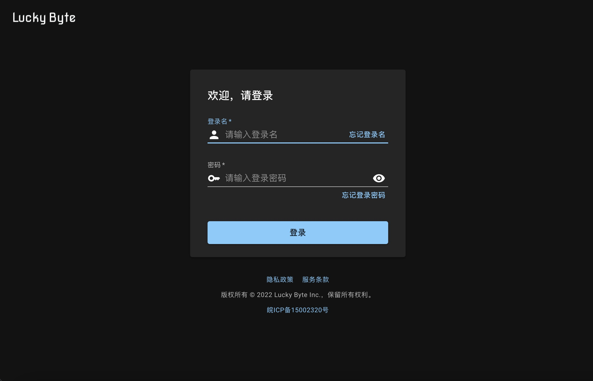

# ReactGo

React + Go 项目模板。

**项目尚未达到 1.0 状态，欢迎试用，如有问题请提交 issue**

## 文档

https://reactgo.kross.work

## DEMO

[演示地址](http://reactgo.lucky-byte.net:23890/)，账号密码: `reactgo`

## 快速上手

### 准备工作

需要一台安装 nodejs 和 go 编译环境的主机，本文档以 MacOS 为例， 其他系统需要做适当的调整。

### 创建新仓库

#### GITHUB（新仓库只有代码，没有提交历史）

打开 [ReactGo 仓库](https://github.com/lucky-byte/reactgo)，
在页面中找到 `Use this template` 绿色按钮，点击它（懒得找直接点
[这里](https://github.com/lucky-byte/reactgo/generate) 也行），
将开始创建一个新的仓库，按照页面的提示创建仓库，完成后 clone 到你的开发机。

#### GITEE 及其它平台

在项目页面找到 `Fork` 按钮，点击创建你的 fork 仓库，完成后将你的仓库 clone 到你的开发机。

### 初始化数据库

> 继续前，需要安装一个工具 `migrate`，可以从
> [migrate 项目页](https://github.com/golang-migrate/migrate/releases) 下载，
> 请注意，这里下载的版本不支持 Sqlite 驱动，如果要用 Sqlite 驱动，需要自己从源码编译。
>
> 为了方便，我们编译了一个包含 Sqlite 驱动的版本（Linux amd64 版本），你可以从
> [这里](https://gitee.com/lucky-byte/reactgo/attach_files/985329/download/migrate-linux-amd64) 下载。

ReactGO 支持 `Sqlite`, `MySQL`, 以及 `PostgreSQL`。

这里以 Sqlite 为例，打开一个终端窗口，进入 `migrate` 子目录，运行
`./migrate-sqlite.sh up` 初始化数据库，创建的数据库文件为 `/tmp/reactgo.db`。

> 默认在 `/tmp` 下创建数据库文件，你可以打开 `migrate-sqlite.sh` 进行修改。
>
> 如果修改数据库文件名，也需要修改 `config.yaml` 配置文件中的数据库配置与之对应，
> 否则无法成功连接数据库。

### 启动前端

开一个终端窗口，进入仓库 `web` 子目录，运行 &#9332; `yarn` 安装 npm 模块，
然后运行 &#9333; `yarn build` 构建，完了运行 &#9334; `yarn start` 启动前端开发服务器，
会在浏览器打开登录页面。
一共要运行 3 个命令。

### 启动后端

运行 &#9332; `make` ，完了运行 &#9333; `./reactgo -adduser -config ./config.yaml`，
按照提示添加一个后台用户（**注意会在终端打印一个随机密码**，登录需要）。

运行 &#9334; `make dev` 启动后台服务，然后转到浏览器，使用刚刚创建的用户登录。

### 遇到问题

我们的目标是让系统即可能的简单，如果你按照上面的操作出现问题，说明系统还不够简单，请
[提交一个 issue](https://github.com/lucky-byte/reactgo/issues)。
如果是网络连接方面的问题，例如不能访问 npm 或 github 网站，那需要自行在网上找一些方法。
